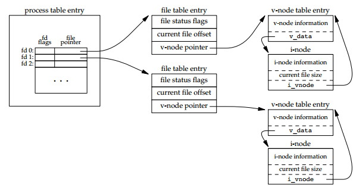
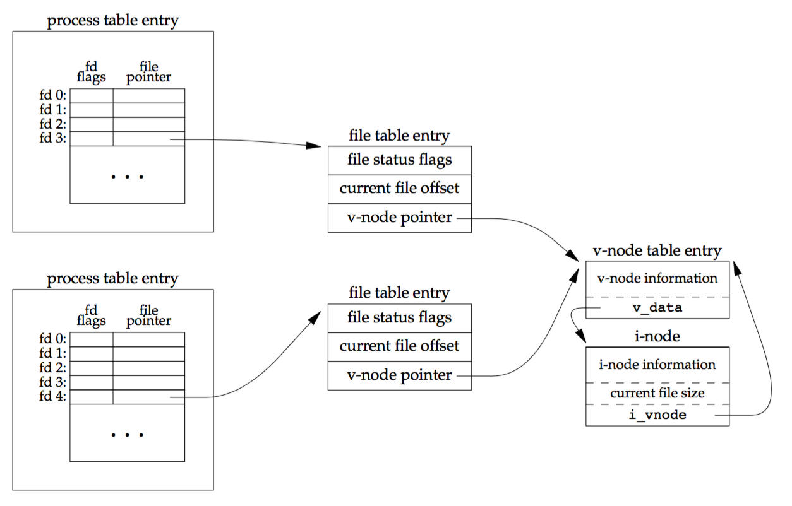
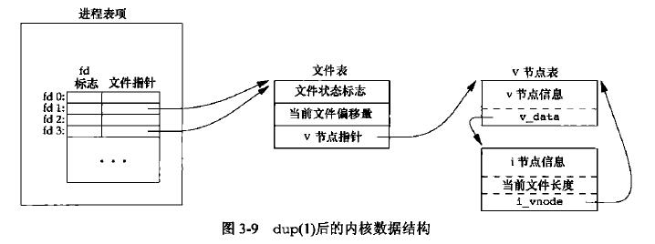

## 文件共享 

UNIX 系统支持在不同进程间共享打开文件, 知识点：内核用于所有 I/O 的数据结构、原子操作。

### 概念性的 I/O 数据结构

内核用于所有 I/O 的数据结构，只是个概念性的，不一定适用，有个大体的轮廓就 OK。

- 进程表 (process table entry) 中的记录
- 文件表项 (file table entry)
- v节点表项 (v-node table entry)



这是一个 `打开文件的内核数据结构` 图。`打开文件` 这个操作是一个进程, 每个进程在进程表中都有一个记录，而 `打开文件进程记录` 中包含一张打开文件描述符表, 包括：

- 文件描述符标志
- 指向一个文件表项的指针

文件描述符表用 Go 抽象如下表示：

``` go
type fd struct {
	flags   int
	pointer *FileTableEntry
}
```

代码中 `flags` 的类型是随便定义的（实际我没查），由图中看出 `pointer` 指向文件表项 (file table entry), 内核为所有打开文件维持一张文件表, 每个文件表项包括：

- 文件状态标志 (读、写、添写、同步和非阻塞)
- 当前文件偏移量
- 指向该文件 v 节点表项的指针

文件表项用 Go 抽象如下表示：

``` go 
type FileTableEntry struct {
	status  int
	offset  int
	pointer *VNodeTableEntry
}
```

由图中看出 `pointer` 指向v节点表项 (v-node table entry), 每个打开文件都有一个 v 节点结构如下所示：

- 文件类型和对此文件进行各种操作函数的指针，统称为 v节点信息
- 该文件的 i 节点: 文件所有者、文件长度、指向文件实际数据块在磁盘上所在位置的指针等

V 节点表项和 i 节点用 Go 抽象如下：

``` go 
type VNodeTableEntry struct {
	information *Information
	vData       *INode
}

type INode struct {
	owner           *Owner
	length          int
	vNodeTableEntry *VNodeTableEntry
}
```

通过这种方式，来加深对 `内核通用 I/O 数据结构` 的理解。

如果两个独立进程各自打开同一个文件，则三者关系如下所示：



### 原子操作

一般而言，原子操作 (atomic operation) 指的是由多步组成的一个操作。如果该操作原子地执行，则要么执行完所有步骤，要么一步也不执行，不可能只执行所有步骤的一个子集。

### 函数 dup 和 dup2

下面两个函数都可用来复制一个现有的文件描述符。

``` c
#include <unistd.h>

int dup(int fd);

int dup2(int fd, int fd2);
```

上面函数中的参数：

- fd 表示要复制的文件描述符
- fd2 表示复制后的文件描述符

`dup2` 函数是可以指定复制后的文件描述符，而 `dup` 是返回当前可用文件描述符中的最小数值。

调用 `dup(1)` 函数后，进程表项，文件表，v 节点表，之间的关系图如下：



对于传入的参数 fd2, 已经被打开了，会先关闭。知道了这个点，就明白了，下面的操作中会先调用 `close(fd2)`。

很不爽了，没找到相应的 Go 的源码。复制一个描述符的另一种方法是使用 `fcntl函数`, `dup2(fd, fd2)` 等效于 `close(fd2)` 和 `fcntl(fd, F_DUPFD, fd2)`, 但不完全等效，因为 `dup2(fd, fd2)` 是个原子操作。

目前我先知道 `fcntl函数` 可以改变已经打开文件的属性，就可以啦。
